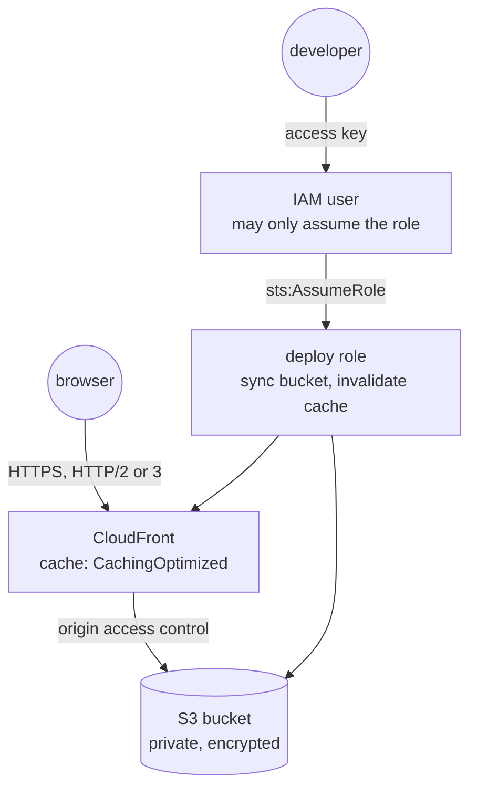

# Deployment (AWS)

`terraform/aws/` creates the hosting: a private S3 bucket holding a copy of
`website/`, served by CloudFront over HTTPS, and a deploy identity that can
do nothing but update the site. It works with Terraform or OpenTofu.

## Bucket and CDN <Badge type="tip" text="standard" />

::: code-group
<<< @/../terraform/aws/main.tf#bucket-policy [terraform/aws/main.tf#bucket-policy]
<<< @/../terraform/aws/main.tf#cloudfront [terraform/aws/main.tf#cloudfront]
:::

The standard private-bucket pattern:
- All public access is blocked. The bucket policy denies non-HTTPS access
  and lets only this CloudFront distribution read objects, via origin
  access control.
- Objects are encrypted at rest. A lifecycle rule drops interrupted
  multipart uploads.
- CloudFront redirects HTTP to HTTPS, compresses responses, and uses AWS's
  managed "CachingOptimized" policy.

Both S3 and CloudFront serve range requests, which the COG readers need.
`http_version = "http2and3"` matters for COG tiles: over HTTP/2 or 3 the
site allows 24 concurrent tile requests instead of 6
([COG layers](/website/cog-layers#workers-and-request-limits)).

A custom domain is optional and takes two steps: set `domain_name` to
request a certificate; once it is validated and issued, set
`attach_domain = true`. The steps are in `terraform.tfvars.example`.
Every resource is tagged with `Service` and `Environment`, as the FinOps
tagging policy requires (`versions.tf`).

## Deploy identity <Badge type="warning" text="decision" />

::: code-group
<<< @/../terraform/aws/iam.tf#deploy-role-policy [terraform/aws/iam.tf#deploy-role-policy]
<<< @/../terraform/aws/outputs.tf#deploy-commands [terraform/aws/outputs.tf#deploy-commands]
:::

::: warning Design decision: a key that can only assume a role
The long-lived access key belongs to an IAM user whose only permission is to
assume the deploy role. The role may list, read, write and delete objects in
this one bucket, and create invalidations on this one distribution. A leaked
key can therefore only overwrite this site. The secret key is in the
Terraform state, so `terraform.tfstate` must stay private (it is
git-ignored).
:::

`just deploy` reads `deploy_commands` from the state in the team's S3
state bucket and runs them. `aws s3 sync --delete` uploads `website/`
(including `image-data/`, `catalog.json` and `vendor/`) with
`Cache-Control: public, max-age=300`. The invalidation then clears
CloudFront's cache.
