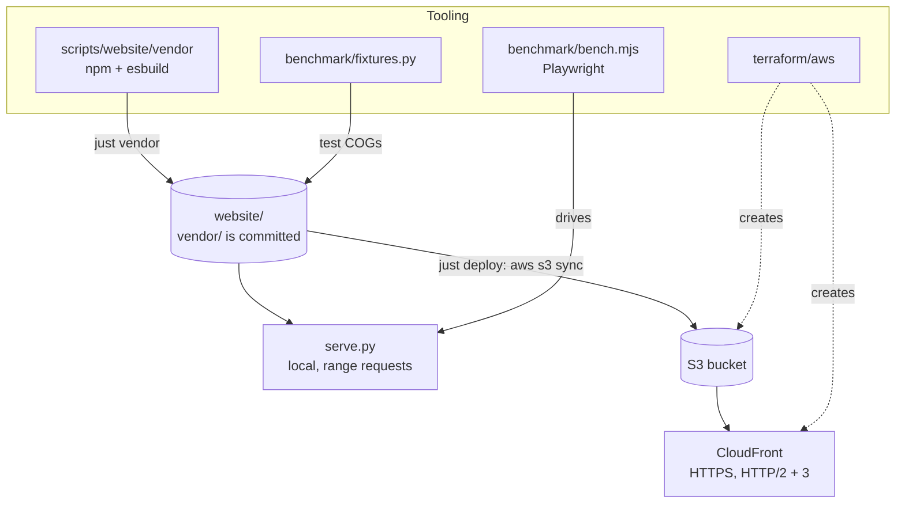

# Build, deploy, test

The site needs no build step to run: its JavaScript runs as written. Three
things around it do have tooling:

| Piece | What | Page |
|---|---|---|
| Vendored bundle | deck.gl + deck.gl-raster as one committed ES module, rebuilt with `just vendor` | [Vendored bundle](./vendor) |
| Local server | `serve.py`: the repository root over HTTP, with range requests | [Local development](./local) |
| Hosting | Terraform: private S3 bucket behind CloudFront, plus a minimal deploy identity; `just deploy` | [Deployment](./deploy) |
| Tests | Credential-free fixture COGs and a before/after benchmark in headless Chromium | [Fixtures and benchmark](./benchmark) |

There are no unit tests. The renderer was checked by comparing screenshots
against the previous version product by product, and is measured by the
benchmark.
