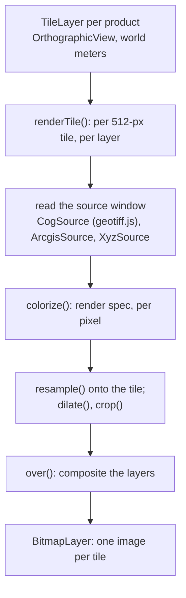
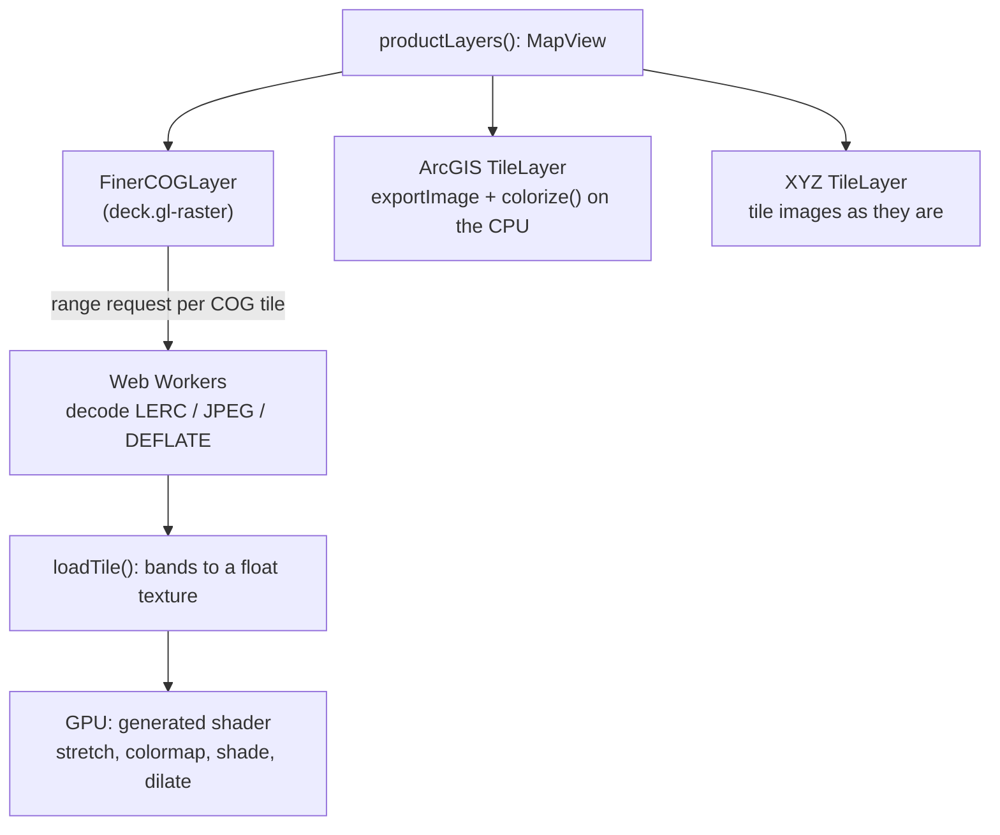

# Old vs new renderer

The website's renderer was migrated from **geotiff.js plus a CPU colorizer**
to **deck.gl-raster plus generated GPU shaders**. This section compares the
two implementations. Historical code (commit `bd8e191`, before the
migration) is copied into these pages and labeled `@ bd8e191`. Current code
is shown from the source files, labeled with its file and region.

The [migration report](/deck-gl-raster) is the write-up that came with the
change: process, upstream issues and the update procedure. This section
goes through the code.

## Before and after

### Before: one TileLayer per product, everything per tile on the main thread

All of it ran on the main thread, in JavaScript.

### After: one deck.gl layer per product layer

## At a glance

| | Before | After | Page |
|---|---|---|---|
| COG reading | geotiff.js `readRasters` over a window; its block cache | deck.gl-raster `fetchTile`, one range request per COG tile | [Reading COGs](./reading) |
| Overview choice | coarsest level at least as fine as the 512-px deck.gl tile | deck.gl-raster traversal, corrected (`FinerCOGLayer`) | [Reading COGs](./reading#choosing-the-overview) |
| Decoding | main thread | Web Workers | [Reading COGs](./reading) |
| Coloring COGs | JavaScript, per pixel, per tile | GLSL generated per render spec, per screen pixel | [Coloring](./coloring) |
| Coloring ArcGIS tiles | JavaScript | unchanged (same code) | [Coloring](./coloring#what-stayed) |
| Pixel placement | colors resampled onto 512-px tiles (edges snap to tile pixels) | mesh from the geotransform (edges exact) | [Reading COGs](./reading#resampling-vs-meshes) |
| Layers of a product | composited into one bitmap per tile (`over`) | separate deck.gl layers | [Views and compositing](./views#compositing) |
| deck.gl view | `OrthographicView` in world meters | `MapView`; world meters kept in the app | [Views and compositing](./views) |
| Swipe clipping | one clip box in world meters | per coordinate system (lng/lat or common space) | [Views and compositing](./views#compare-modes) |
| Street maps | fetched into a canvas mosaic, resampled per tile | plain `TileLayer` of the tiles | [Basemaps and services](./services) |
| ArcGIS float TIFFs | geotiff.js + hand-written sparse-tile reader | bundled reader, `fetchTile` per internal tile | [Basemaps and services](./services#arcgis-float-tiffs) |
| Libraries | deck.gl UMD (unpkg) + geotiff.js (jsDelivr) | one vendored bundle | [Vendored bundle](/build/vendor) |

## What the migration removed and added

- **Removed from `tiles.js`** (~450 lines): `CogSource`, `XyzSource` with its
  tile cache and mosaicking, `readSparseTiles`, `getSource`, `bandsToRgba`,
  `renderBands`, `resample`, `resampleSmooth`, `dilate`, `over`,
  `renderTile`, the product-level `productLayer`.
- **Added**: `cog.js` (~480 lines: tile upload, render spec → GLSL, dilation
  with an occupancy texture, the overview workaround), MapView conversions
  and per-coordinate-system clip props in `mapview.js`, the vendored bundle
  and its build.
- **Net**: application JavaScript grew from 1,861 to about 2,240 lines. The
  gains are in where the work runs and in correctness, not in code size.
