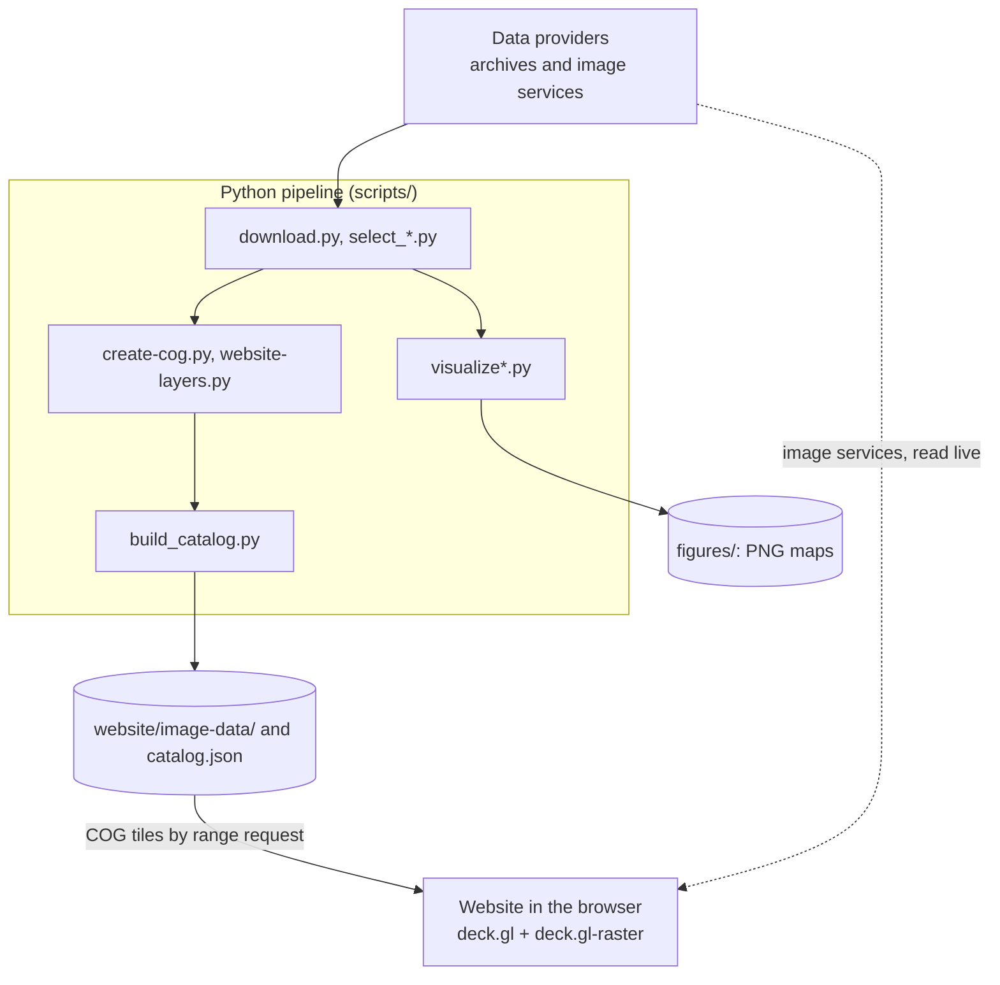

# New Haven at many resolutions

This project shows what New Haven, Connecticut looks like in remote-sensing
data at very different spatial resolutions: from 7.6 cm aerial photographs to
a 9 km soil-moisture model. Seventeen datasets, 39 products, plus three street
maps for reference, all cover the same area. They come out in two forms:

- **Figures**: PNG maps of two fixed views. All figures of a view are
  pixel-aligned, so they can be compared directly or flipped through.
- **A website**: an interactive map viewer. You pick an image, pan and zoom
  down to its native pixels, compare two images (swipe, fade, or a lens),
  and lay several images side by side in a synchronized grid.

This page summarizes the whole project. Each section links to a more
detailed page; those pages link to the code. [How to read these
docs](/guide/reading) explains the conventions, including the colored boxes
that separate standard practice from the decisions worth reviewing.

## The pieces

### 1. Data pipeline (Python)

One folder per dataset under `scripts/`, plus shared code in
`scripts/common/`. Each script is a standalone [PEP 723](/guide/glossary#pep-723)
script, run with `uv run`. For each dataset:

1. **Download** the data covering the views into `data/<dataset>/`. A few
   datasets first run a script that picks the scene, granule or day.
2. **Visualize**: resample the data onto each view's pixel grid, color it,
   and write a plain and a labeled PNG to `figures/<dataset>/`.
3. **Prepare website data**: write a [Cloud-Optimized GeoTIFF](/guide/glossary#cog)
   of the real values (temperatures, elevations, reflectances) and a JSON
   *render spec* that says how to color them. Datasets that the website reads
   live from an image service write only the JSON.
4. `build_catalog.py` gathers all the JSON into `website/catalog.json`, the
   website's image menu.

→ [Data pipeline overview](/pipeline/)

### 2. Map viewer (JavaScript)

A static web page: no server-side code and no build step for the
application code. It loads `catalog.json` and draws every image itself, tile
by tile:

- **Local COGs** are read and drawn by [deck.gl-raster](/guide/glossary#deck-gl-raster).
  Each render spec is compiled into a GPU [shader](/guide/glossary#shader),
  so coloring runs on the graphics card.
- **ArcGIS image services** (orthophotos, NAIP, lidar, 3DEP) are requested
  tile by tile and colored in the browser's main thread.
- **Street-map tiles** are drawn as they come.

→ [Map viewer overview](/website/)

### 3. Build, deployment and tests

- deck.gl and deck.gl-raster are bundled into one file in `website/vendor/`,
  which is committed.
- `serve.py` runs the site locally.
- Terraform puts it on Amazon S3 behind CloudFront.
- A fixtures script and a headless-browser benchmark check the renderer
  without credentials.

→ [Build, deploy, test](/build/)

### 4. The renderer migration

The website used to read COGs with geotiff.js and color them on the CPU.
That code was replaced with deck.gl-raster. A dedicated section compares the
two implementations side by side: what was removed, what the website still
does itself, and how performance changed.

→ [Old vs new renderer](/comparison/)

### 5. Issues and improvements

Problems and possible improvements found while writing these docs,
ranked by severity and marked as introduced by the migration or older.
The most serious: hillshades are lit from the wrong direction, and
`just preview` serves the whole repository, credentials included, to the
network.

→ [Issues and improvements](/issues)

## Key design decisions

These choices shape everything else. Each is explained where it is
implemented.

| Decision | Why | Where |
|---|---|---|
| Every map is drawn on fixed [Web Mercator](/guide/glossary#web-mercator) grids; coarse data are resampled with nearest neighbor, never smoothed | Native pixels stay visible as blocks with their true footprint, which is the point of the project | [Views and grids](/pipeline/views-and-grids) |
| Website data are stored as physical values; colors are declared in a JSON render spec and applied in the browser | One COG serves several products (Landsat: 5 composites from one file), and the colorbar comes from the same spec as the colors | [Website data](/pipeline/website-data) |
| Coarse data are stored on a grid of ~30 m or finer | Each native pixel keeps its footprint to within 15 m after reprojection | [Views and grids](/pipeline/views-and-grids#fine-grids-for-the-website) |
| Large public image services are read live, not copied | No 45-gigapixel copies; the services already tile and resample | [Image-service layers](/website/image-services) |
| COGs are read and drawn by deck.gl-raster, with shaders generated from the render specs | Decoding moves to workers and coloring to the GPU; edges land exactly on the geotransform | [COG layers](/website/cog-layers) |
| The maps use deck.gl's `MapView`, but the app keeps its own "world" coordinates | deck.gl-raster needs a geographic view; the existing pan/zoom, axes and URL code keep working | [Map views](/website/map-views) |
| The grid draws all its maps on one WebGL canvas | Browsers limit the number of WebGL contexts; one canvas scales to any number of slots | [Viewer, compare and grid](/website/viewer-and-grid#one-canvas-for-the-grid) |
| deck.gl-raster is bundled and committed, pinned to exact versions | It is a fast-changing beta; the site must not need a build to deploy | [Vendored bundle](/build/vendor) |

## Repository layout

| Path | What |
|---|---|
| `scripts/<dataset>/` | Per-dataset scripts ([datasets](/pipeline/datasets/)) |
| `scripts/common/` | Shared Python: views, resampling, figures, web data, remote services |
| `scripts/website/` | `build_catalog.py`, `serve.py`, `vendor/` (bundle build), `benchmark/` |
| `data/` | Downloads (not tracked, except `landmarks.json`) |
| `figures/` | Output PNGs (not tracked) |
| `website/` | The static site: `index.html`, `js/`, `css/`, `vendor/`; generated `catalog.json` and `image-data/` (not tracked) |
| `terraform/aws/` | Hosting infrastructure |
| `justfile` | `just download`, `just build`, `just vendor`, `just deploy`, `just preview` |
| `docs/` | This documentation (VitePress): `npm run dev` in `docs/` |
