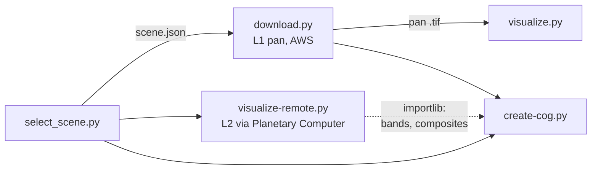

# Optical imagery

Four sources, from 7.6 cm aerial photography to 30 m Landsat. The two aerial
sets are read live from Connecticut's image services. Planet is stored
locally to keep its API key out of the browser. Landsat is stored locally
because the website builds five products from its bands.

## CT orthoimagery 2023

**7.6 cm (3 in), 4 bands, leaf-off, flown 2023-03-27 to 04-13.** Scripts:
`visualize-remote.py`, `website-layers.py`.

- **Figures** request raw 8-bit bands from the CT ECO `Ortho_2023`
  ImageServer through [`arcgis_export_image`](../remote#arcgis-exportimage-and-wms).
  They use the same oversampling as NAIP (below) and a pooled percentile
  stretch with gamma 1.4, brighter than NAIP's 1.15 because leaf-off
  vegetation is dark. Products: true color (bands 0, 1, 2) and color infrared
  (3, 0, 1).
- **Website**: an `arcgis_source` per product with server-side band
  reordering, shown unstretched (`identity`). No copy of the ~45-gigapixel
  mosaic is made.
- The service has no per-tile dates, so the flight window is a constant
  taken from CT ECO's metadata page.

## NAIP

**0.3 m, 4 bands, flown 2023-07-05 to 07-11.** Scripts: `visualize-remote.py`,
`website-layers.py`.

::: warning Design decision: CT ECO instead of the Planetary Computer
The same USDA tiles (DOQQs) are on the Planetary Computer. CT ECO serves
them already mosaicked, as raw values, through the same `exportImage`
interface as the CT orthoimagery, so both use one code path.
:::

::: code-group
<<< @/../scripts/naip/visualize-remote.py#oversample-block-average [scripts/naip/visualize-remote.py#oversample-block-average]
:::

The figures request twice the view's pixel density and average 2 × 2 blocks.
The server reads its overview pyramid bilinearly; averaging a 2× request
avoids aliasing at the view's pixel size. Flight dates come from the catalog
names of the tiles covering each view (`/query`, USDA naming `..._YYYYMMDD_...`).

::: code-group
<<< @/../scripts/naip/website-layers.py#server-values-as-is [scripts/naip/website-layers.py#server-values-as-is]
:::

`acquisition_dates()` and the service constants are duplicated between the
two NAIP scripts, and `fetch_bands` between NAIP and CT ortho. The scripts
are standalone, so they don't import each other.

## Planet

**4.8 m Mercator (≈3.6 m ground), monthly basemap, July 2026.** Scripts:
`visualize-remote.py`, `create-cog.py`.

The tiles come from Planet's basemap XYZ service at zoom 15, its native
level; Planet would only upsample at finer zooms. The figures use average
resampling for the greater view (native finer than 5.6 m) and nearest
neighbor for the central one, so blocks show. The API key is never printed:
request errors are re-raised with the key replaced by `<planet_api_key>`.

::: code-group
<<< @/../scripts/planet/create-cog.py#tile-aligned-grid [scripts/planet/create-cog.py#tile-aligned-grid]
:::

::: warning Design decision: a local copy to keep the key private
The website could read Planet tiles live like the street maps, but the key
would be visible in the browser. Instead the z15 tiles are copied 1:1 onto
a grid whose pixels are the tile pixels (nearest neighbor), and stored as a
~20 MB JPEG COG. Missing tiles have no no-data mask: alpha is dropped, and
only the no-data fraction is printed.
:::

## Landsat 8

**30 m surface reflectance and temperature (Collection 2 Level-2), 15 m
panchromatic (Level-1), 2024-08-27.** Scripts: `select_scene.py`, `scene.py`,
`download.py`, `visualize.py`, `visualize-remote.py`, `create-cog.py`.

`scene.py` holds the dataset name and loads `scene.json`, the shared state
written by `select_scene.py`.

### Scene selection <Badge type="warning" text="decision" />

::: code-group
<<< @/../scripts/landsat/select_scene.py#scene-selection-criteria [scripts/landsat/select_scene.py#scene-selection-criteria]
<<< @/../scripts/landsat/select_scene.py#view-cloud-check [scripts/landsat/select_scene.py#view-cloud-check]
:::

It searches the Planetary Computer STAC for Landsat 8 scenes with under 5%
scene cloud, newest first, in the growing season (May 20 – Sep 30). It takes
the first whose footprint contains both views and whose `QA_PIXEL` band,
read over the padded views only, shows less than 0.1% cloud, cirrus or
shadow and no fill. Scene-level cloud cover is too coarse: a 3%-cloudy scene
can have its clouds right over New Haven.

### Level-1 panchromatic band <Badge type="warning" text="decision" />

Level-2 products have no panchromatic band. `find_l1` finds the matching
Level-1 scene in the USGS LandsatLook STAC (same date, path and row) and
records its S3 location:

::: code-group
<<< @/../scripts/landsat/select_scene.py#find-level1-pan [scripts/landsat/select_scene.py#find-level1-pan]
<<< @/../scripts/landsat/download.py#requester-pays-window [scripts/landsat/download.py#requester-pays-window]
:::

Level-1 data are only in the AWS requester-pays bucket, so `download.py`
needs AWS keys. It reads only the padded window (a few hundred KB), with
`GDAL_DISABLE_READDIR_ON_OPEN` so GDAL does not list the bucket.

### Level-2 bands and composites

::: code-group
<<< @/../scripts/landsat/visualize-remote.py#band-composites [scripts/landsat/visualize-remote.py#band-composites]
<<< @/../scripts/landsat/visualize-remote.py#titiler-chunked-fetch [scripts/landsat/visualize-remote.py#titiler-chunked-fetch]
:::

The Planetary Computer's data API (titiler) reprojects and crops the bands
server-side, straight onto each view's EPSG:3857 grid, with nearest
neighbor. Full-view 7-band responses (>100 MB) drop, so the view is fetched
in chunks with retries. DNs (digital numbers, the stored integers) are
converted with the Collection 2 scale factors: reflectance =
DN × 2.75e-5 − 0.2, temperature = DN × 0.00341802 + 149 K.

::: warning Design decision: true color shares one stretch
Each composite stretches each band between its 1st and 99th percentile over
the greater view, except true color: its three bands share one range. That
keeps the color balance (gray stays gray), at the cost of less contrast.
:::

### Website COGs

::: code-group
<<< @/../scripts/landsat/create-cog.py#l2-cog-fetch [scripts/landsat/create-cog.py#l2-cog-fetch]
<<< @/../scripts/landsat/create-cog.py#website-stretches [scripts/landsat/create-cog.py#website-stretches]
:::

All seven Level-2 bands go into one 30 m COG, as reflectance and °C (LERC
error 0.0005). The 15 m pan band goes into a separate COG. The five
products are render specs over these files: four `rgb` composites with the
same stretches as the figures, and an `inferno` colormap for temperature.
Unlike the figure script, `fetch_l2` makes one unchunked request without
retries. It covers the 30 m grid (717 × 404 px), much smaller than a
3840 × 2160 view.
