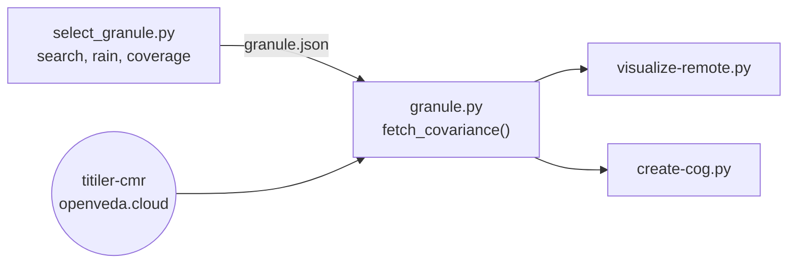

# Radar (NISAR)

**NISAR L2 GCOV (geocoded polarimetric covariance), L-band, frequency A,
10 m, 2026-07-17 09:59 UTC.** Scripts: `granule.py` (shared),
`select_granule.py`, `visualize-remote.py`, `create-cog.py`.

NISAR is a NASA–ISRO radar satellite. GCOV gives backscattered power for
HH and HV polarizations (transmit horizontal, receive horizontal or
vertical) on a map grid. The products are four dual-polarization color
composites and the two single polarizations, all in decibels (dB).

## Choosing the granule <Badge type="warning" text="decision" />

::: code-group
<<< @/../scripts/nisar-gcov/select_granule.py#granule-filtering [scripts/nisar-gcov/select_granule.py#granule-filtering]
<<< @/../scripts/nisar-gcov/select_granule.py#driest-acquisition [scripts/nisar-gcov/select_granule.py#driest-acquisition]
:::

::: warning Design decision: driest ascending pass
- **Ascending passes only** (morning, about 6 am local). Evening descending
  passes see wind-roughened water, which is bright and hides the coastline;
  morning water is calm and dark.
- **Driest first.** Wet soil and canopy raise backscatter. Candidates are
  ranked by ERA5 precipitation in the 72 hours before the pass (from
  Open-Meteo), ties broken by distance from the frame edge.
- Reprocessed duplicates are dropped (the latest version is kept), as are
  granules without HH and HV, partial frames, and frames whose edge is
  less than 5 km from the view.
- The winner must have ≥ 99.9% valid pixels over the view, checked by
  fetching it at 40 m.
:::

The script also reads metadata from the HDF5 file over HTTPS: the grid
origin, incidence angle and acquisition time at the view center. It stores
them in `granule.json`.

## Reading through titiler-cmr <Badge type="warning" text="decision" />

::: code-group
<<< @/../scripts/nisar-gcov/granule.py#titiler-cmr-params [scripts/nisar-gcov/granule.py#titiler-cmr-params]
<<< @/../scripts/nisar-gcov/granule.py#native-grid-snapping [scripts/nisar-gcov/granule.py#native-grid-snapping]
<<< @/../scripts/nisar-gcov/granule.py#fetch-covariance [scripts/nisar-gcov/granule.py#fetch-covariance]
:::

titiler-cmr (on NASA's openveda.cloud) reads a granule's HDF5 variables
and returns GeoTIFFs of any box. Three choices make it reproduce the native
data exactly:

- `granule_ur` restricts the request to one granule, so nothing is
  mosaicked across dates or frames.
- The box is snapped to the native 10 m pixel edges (`snap_bounds`) and
  requested in the native CRS with nearest neighbor. The output is then the
  native grid, which was checked against the HDF5 file.
- The service runs on AWS Lambda, which caps responses at 6 MB. Requests are
  split into chunks of at most 640 × 640 px × 2 float32 bands (~3.3 MB),
  fetched in parallel, and each chunk's shape is checked.

## Products

::: code-group
<<< @/../scripts/nisar-gcov/visualize-remote.py#db-channel-ranges [scripts/nisar-gcov/visualize-remote.py#db-channel-ranges]
<<< @/../scripts/nisar-gcov/create-cog.py#db-cog [scripts/nisar-gcov/create-cog.py#db-cog]
:::

The channels are HH and HV in dB and their ratio, HH − HV in dB. The
ranges and channel assignments follow the titiler-cmr browser's NISAR
renders.

::: warning Design decision: store dB, compute the ratio in the browser
titiler-cmr reads the HDF5 for every request, which is too slow for
interactive tiles, so the website gets a local COG. It stores HH and HV
already in dB (LERC error 0.01 dB). The ratio is not stored: the render
spec's expression `"hh - hv"` computes it per pixel in the browser.
:::
