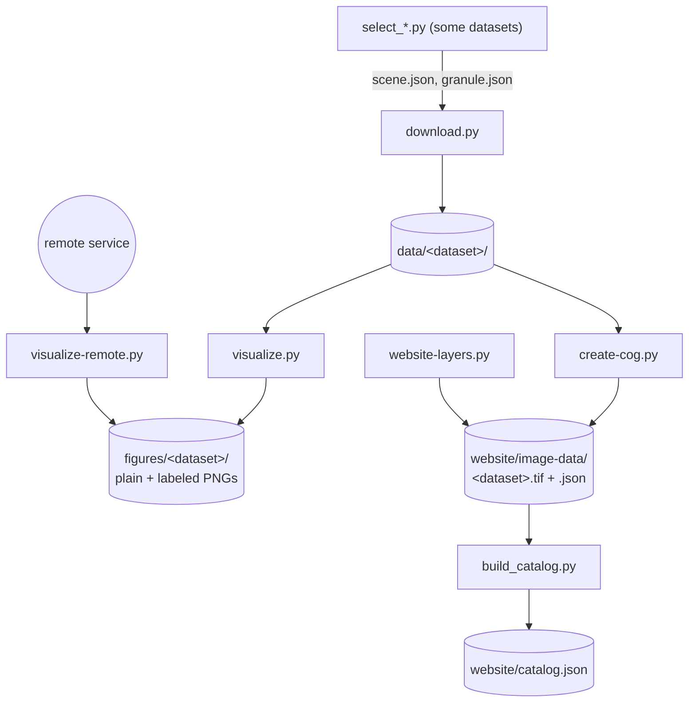

# Data pipeline

The pipeline turns each dataset into **figures** (PNG maps) and **website
data** (COGs and render specs). It is a set of standalone Python scripts, one
folder per dataset, sharing helpers in `scripts/common/`. There is no
framework and no orchestration. You run the scripts of a dataset in order,
or all datasets with `just download` and `just build`.

## Scripts of a dataset



| Script | Does | Datasets |
|---|---|---|
| `select_scene.py`, `select_granule.py`, `select_day.py`, `find_rainy_days.py` | Choose the scene, granule or day; save the choice to `data/` or print a ranking | landsat, nisar-gcov, era5-land, chirps |
| `download.py` | Fetch the data covering both views into `data/<dataset>/`; skip what is already there | most |
| `visualize.py` | Read `data/`, write the figures | datasets with a download |
| `visualize-remote.py` | Read straight from a service, write the figures | image services, Landsat L2, NISAR, Planet |
| `create-cog.py` | Write a COG and its render spec to `website/image-data/` | data the website reads locally |
| `website-layers.py` | Write only a render spec that points the website at a live service | ct-ortho-2023, naip, ct-lidar-2023, 3dep, streetmap |

All scripts begin the same way. A typical small one:

::: code-group
<<< @/../scripts/smap/visualize.py [scripts/smap/visualize.py]
:::

::: tip Standard practice
- **PEP 723 header** (lines 1–4): each script declares its own dependencies,
  so `uv run scripts/smap/visualize.py` works with no environment setup.
- **`sys.path` lines**: let the script import `scripts/common/` and its own
  folder's modules.
- **`main()` guard**: the usual Python entry point.
:::

::: warning Design decision: figures and website share one definition
`create-cog.py` imports its colormap, value range, source text and data
reader from the same folder's `visualize.py` (or `download.py`). The figure
and the website version of a product therefore always use the same colors.
Where a create script needs a file with a hyphen in its name
(`visualize-remote.py`), it loads it with `importlib`. The cost: running
`create-cog.py` imports the plotting code too.
:::

## Shared code (`scripts/common/`)

| Module | Provides | Page |
|---|---|---|
| `views.py` | The two map views (Greater New Haven, Central New Haven) | [Views and grids](./views-and-grids) |
| `render.py` | Resampling onto a view, colors, hillshade, labeled figures | [Views and grids](./views-and-grids), [Figures](./figures) |
| `styles.py` | Color scales shared by several datasets (elevation, land surface temperature) | [Figures](./figures#shared-color-scales) |
| `remote.py` | HTTP session with retries; XYZ tiles, ArcGIS `exportImage` and WMS fetched onto a view grid | [Remote services](./remote) |
| `web.py` | Website grids, COG writing, render specs | [Website data and the catalog](./website-data) |
| `config.py` | Repository paths (`data/`, `figures/`) and `_credentials.toml` | below |

`config.py` is short enough to show whole:

::: code-group
<<< @/../scripts/common/config.py [scripts/common/config.py]
:::

## Running it

```sh
just download   # every download.py (runs select_scene / select_granule first if needed)
just build      # every create-cog.py and website-layers.py, then build_catalog.py
uv run scripts/<dataset>/visualize.py          # figures, one dataset at a time
```

There is no `just` recipe for the figures; run the `visualize*.py` scripts
directly.

**Credentials.** NASA Earthdata datasets use `~/.netrc` (read by
`earthaccess`). Planet, the Copernicus CDS (ERA5) and AWS (Landsat Level-1)
use keys in `_credentials.toml`, which is not tracked. The
[datasets page](./datasets/) lists which dataset needs what.

## Where to go next

- [Views and grids](./views-and-grids): the geometry everything is drawn on,
  and why coarse data are never smoothed.
- [Figures](./figures): coloring, labels and output files.
- [Remote services](./remote): fetching from tile and image services.
- [Website data and the catalog](./website-data): COGs, render specs, `catalog.json`.
- [Datasets](./datasets/): what each dataset's scripts do, and their notable choices.
