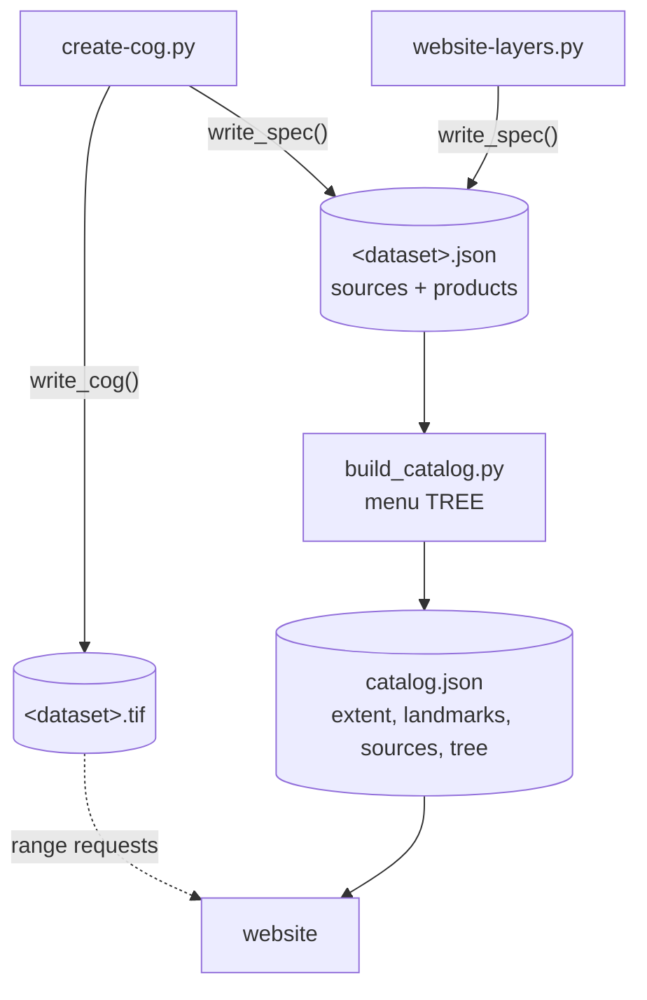

# Website data and the catalog

The website draws every image itself from **data plus instructions**:

- **Sources**: where the values come from. A local COG written by
  `create-cog.py`, an ArcGIS ImageServer, or XYZ map tiles.
- **Render specs**: how to color the values (band combination, value range,
  colormap, shading).

Each dataset script writes both into `website/image-data/<dataset>.json`
(plus the `.tif` for a COG). `build_catalog.py` then merges all the JSON
files into `website/catalog.json`, the only file the website loads at start.
The helpers are in `scripts/common/web.py`.

::: warning Design decision: values in the files, colors in the browser
The COGs hold physical values (°C, meters, reflectance, dB), not colors.
Colors are declared in JSON and applied in the browser. Why:
- **One file, many products.** The Landsat COG has seven bands; five products
  (true color, two false-color composites, urban, temperature) are different
  render specs over the same file. NISAR's ratio channel is computed from its
  two stored bands.
- **The key matches the image.** The colorbar and legend are drawn from the
  same spec that colors the pixels.

**Cost:** the browser must implement every render-spec feature. Today it does
so twice: on the GPU for COGs ([COG layers](/website/cog-layers)) and on the
CPU for ArcGIS services ([Image-service layers](/website/image-services)).
:::

## Writing COGs

::: code-group
<<< @/../scripts/common/web.py#write-cog [scripts/common/web.py#write-cog]
:::

Three kinds, each compressed for what it holds:

| `kind` | Data | Compression | Overviews | No data |
|---|---|---|---|---|
| `float` | measurements, float32 | [LERC](/guide/glossary#lerc) + DEFLATE with a per-dataset maximum error | average | −9999 |
| `jpeg` | 8-bit RGB imagery (Planet) | JPEG, quality 90, band-interleaved | average | none |
| `categorical` | uint8 class codes | DEFLATE (lossless) | mode (most common class) | 0 by default, or none |

All are 512 × 512-pixel tiles on a [website grid](./views-and-grids#grids-for-the-website),
written by GDAL's COG driver. The function returns the *source spec* that
goes into the JSON: URL, band names, bounds, size and pixel size.

::: warning Design decision: per-dataset LERC error
Each dataset chooses `max_z_error`, the largest allowed difference between a
stored value and the original: 0.01 °C for land surface temperature,
0.0005 m³/m³ for soil moisture, 0.002 for ASTER's elevations and hillshade.
It is set well below what the colormap can show, and well below the data's
own accuracy, so the loss is invisible. Files are many times smaller than
with lossless compression.
:::

::: danger Constraints from the browser decoders
- **No data is stored as −9999, not NaN.** The browser's LERC decoder
  ignores LERC's own validity mask: geotiff.js did, and deck.gl-raster 0.8.1
  still does. Values below −9000 are treated as no data, loosely, because
  LERC is lossy.
- **JPEG COGs are band-interleaved** (`interleave="band"`), so each band is
  its own grayscale JPEG. This was needed because geotiff.js did not convert
  YCbCr JPEGs to RGB. deck.gl-raster decodes JPEGs with the browser's image
  decoder, which handles YCbCr. A pixel-interleaved YCbCr JPEG COG would be
  smaller and need one decode per tile instead of three. This is worth doing
  now that geotiff.js is gone, but it is not done yet.
- **Band names must be JavaScript identifiers** (`assert` in `write_cog`),
  because band expressions refer to them by name.
:::

## Sources the website reads live

::: code-group
<<< @/../scripts/common/web.py#arcgis-source [scripts/common/web.py#arcgis-source]
:::

::: code-group
<<< @/../scripts/common/web.py#xyz-source [scripts/common/web.py#xyz-source]
:::

`native_m`, the source's ground pixel size, limits how far the website
requests finer tiles. For ArcGIS sources, `raw=True` asks for float32 values
with a `scale` factor (e.g. US survey feet to meters) and a `nodata` value.
`raw=False` takes the server's 8-bit rendering, with `band_ids` choosing the
red, green and blue bands (CIR = bands 3, 0, 1). XYZ sources are
`smooth=True`: map tiles contain text, so they are scaled smoothly instead of
showing pixel blocks.

## Render specs

A product is a list of **layers** drawn bottom to top. Each layer is a
source name plus a render spec:

::: code-group
<<< @/../scripts/common/web.py#simple-render-specs [scripts/common/web.py#simple-render-specs]
:::

::: code-group
<<< @/../scripts/common/web.py#colormap-spec [scripts/common/web.py#colormap-spec]
:::

::: code-group
<<< @/../scripts/common/web.py#categorical-spec [scripts/common/web.py#categorical-spec]
:::

| `type` | Colors from | Used by |
|---|---|---|
| `identity` | the source's own RGB, optionally desaturated and lightened | imagery, street maps, ICESat-2 basemap |
| `rgb` | three `channel`s, each a band or an expression stretched from `min`..`max` with a gamma | Landsat composites, NISAR composites |
| `colormap` | one band or expression, normalized (linear or log) and looked up in 256 colors, with `under`/`over` colors | temperatures, elevation, soil moisture, ... |
| `categorical` | integer codes looked up in a table; unlisted codes transparent | impervious surface, ICESat-2 |

`colormap` has two shading options:

- `shade` multiplies the colors by a hillshade from another band. That band
  is either stored in the file (`precomputed`, ASTER) or computed in the
  browser from an elevation band (lidar, 3DEP).
- `hillshade=True` colors the hillshade of the band instead of the band.

An `expr` is a JavaScript-style arithmetic expression over band names, with
`log10`, `log`, `exp`, `sqrt`, `abs`, `min`, `max` and `pow`. For example
NISAR's `"hh - hv"`: its bands are in dB, so the difference is the ratio
HH/HV in dB.

The matplotlib colormap and norm used for the figure are converted here:
256 sampled colors, `vmin`/`vmax`, linear or log scale. That keeps the
website's colors identical to the figure's.

::: code-group
<<< @/../scripts/common/web.py#layer-and-product [scripts/common/web.py#layer-and-product]
:::

`dilate_px` grows data pixels by that many screen pixels into the transparent
pixels around them. It keeps sparse 20 m ICESat-2 footprints visible when
zoomed out. The text fields (`title`, `subtitle`, `native`, `source`,
`legend`) are shown around the map.

::: code-group
<<< @/../scripts/common/web.py#write-spec [scripts/common/web.py#write-spec]
:::

## The catalog

`scripts/website/build_catalog.py` reads every `website/image-data/*.json`.
It prefixes source names with their dataset (`landsat/l2`), so names are
unique across datasets:

::: code-group
<<< @/../scripts/website/build_catalog.py#load-and-resolve [scripts/website/build_catalog.py#load-and-resolve]
:::

The menu structure is a hand-written tree. Its labels are short because the
menu shows them under their group names:

::: code-group
<<< @/../scripts/website/build_catalog.py#tree [scripts/website/build_catalog.py#tree]
:::

Products not built (missing JSON) are left out, along with groups that end
up empty, so a partial build still gives a working site. Built products
missing from `TREE` appear under "Other". The output:

::: code-group
<<< @/../scripts/website/build_catalog.py#catalog-json [scripts/website/build_catalog.py#catalog-json]
:::

`catalog.json` holds the extent of the Greater New Haven view, the landmarks
(for the Labels toggle), every source, and the tree with each product's
layers inlined. The website reads nothing else at start-up. See
[Catalog and coordinates](/website/catalog).
