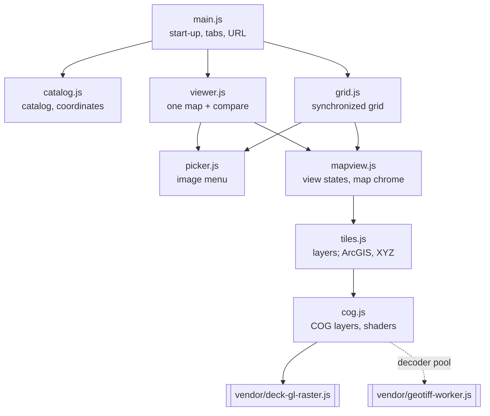
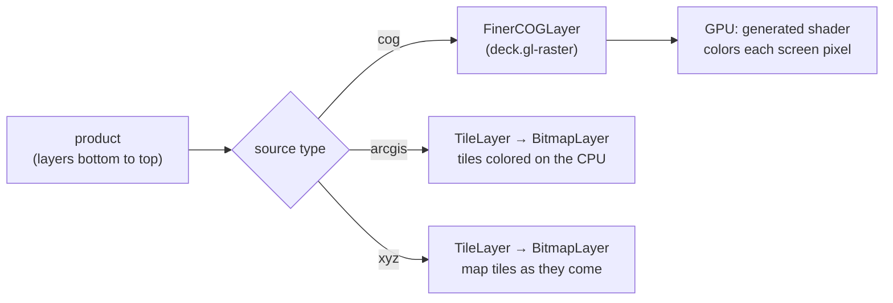
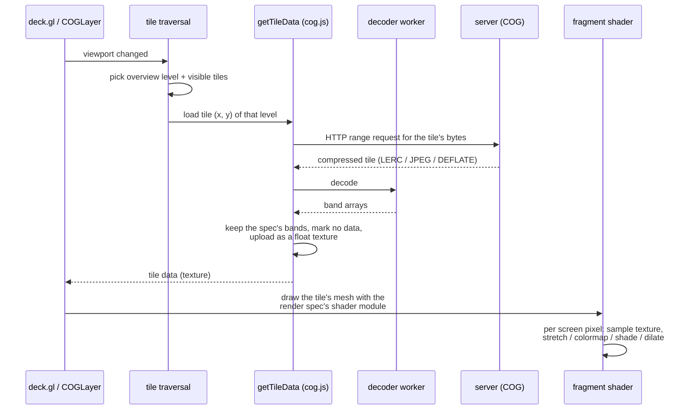

# Map viewer

`website/` is a static site: `index.html`, a stylesheet, eight ES modules in
`js/`, and the vendored deck.gl bundle in `vendor/`. There is no server-side
code and no build step for the application code: the browser loads the
modules as they are. At start-up it fetches `catalog.json` (see
[Website data and the catalog](/pipeline/website-data)); after that it draws
every image itself, tile by tile.

## Modules

All modules import deck.gl from `vendor/deck-gl-raster.js` (deck.gl 9.4 and
deck.gl-raster 0.8.1 in one file); only the main chain is drawn.

| Module | Role | Page |
|---|---|---|
| `main.js` | Loads the catalog, builds the Viewer and Grid, syncs state with the URL, keyboard shortcuts | [Page, picker and URL state](./page) |
| `catalog.js` | The `Catalog` class: product tree, lookups, coordinate conversions | [Catalog and coordinates](./catalog) |
| `viewer.js` | The Viewer tab: one map, optional comparison (swipe, opacity, spy) | [Viewer, compare and grid](./viewer-and-grid) |
| `grid.js` | The Grid tab: many maps with shared pan/zoom on one WebGL canvas | [Viewer, compare and grid](./viewer-and-grid#one-canvas-for-the-grid) |
| `picker.js` | The searchable image menu | [Page, picker and URL state](./page#the-image-picker) |
| `mapview.js` | View-state conversion, zoom limits, compare-mode props, landmarks, axes, scale bar, colorbars, loading messages | [Map views](./map-views) |
| `tiles.js` | Turns a product into deck.gl layers; ArcGIS and XYZ layers | [Image-service layers](./image-services) |
| `cog.js` | COG layers with deck.gl-raster; render spec → shader | [COG layers](./cog-layers) |

## How a map gets drawn

A product is a list of layers (from the catalog). Each layer becomes one
deck.gl layer, chosen by its source type:

For a COG, one tile's journey:

## Key design decisions

::: warning Decisions to review
1. **Each product layer is its own deck.gl layer**, composited by the GPU.
   The old renderer composited layers into one bitmap per tile on the CPU.
   → [Views and compositing](/comparison/views)
2. **COGs are read by deck.gl-raster and colored by shaders generated from
   the render specs.** → [COG layers](./cog-layers)
3. **`MapView` for deck.gl, "world" coordinates for everything else.**
   → [Map views](./map-views)
4. **Image services are read live**, ArcGIS tiles colored on the CPU with
   the same render specs. → [Image-service layers](./image-services)
5. **The grid draws all its maps on one canvas.**
   → [Viewer, compare and grid](./viewer-and-grid#one-canvas-for-the-grid)
6. **All state lives in the URL hash**, so any view can be linked.
   → [Page, picker and URL state](./page#state-in-the-url)
:::

::: tip Standard practice
The rest is ordinary DOM code without a framework: classes that own a piece
of the page, `innerHTML` templates with escaping, event listeners, and a
`requestAnimationFrame` throttle for redraws.
:::
